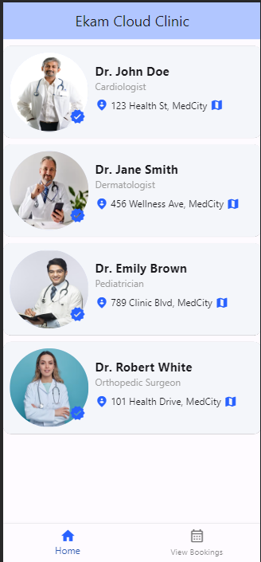
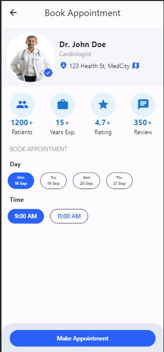
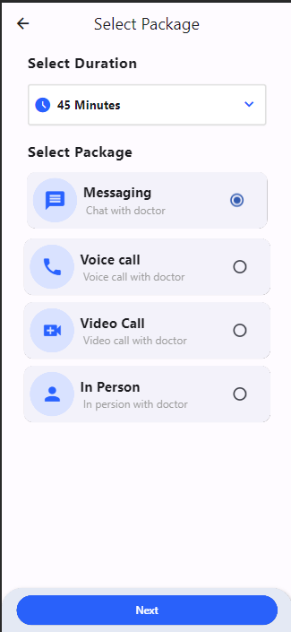
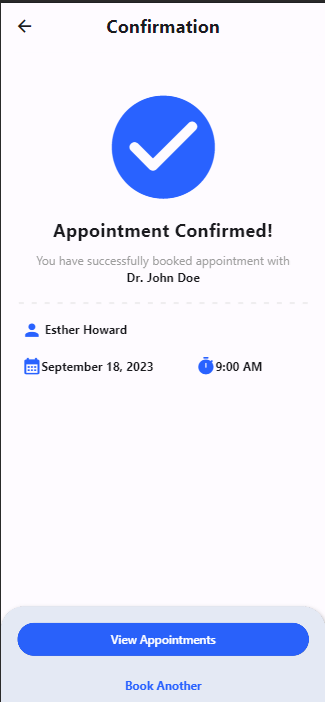
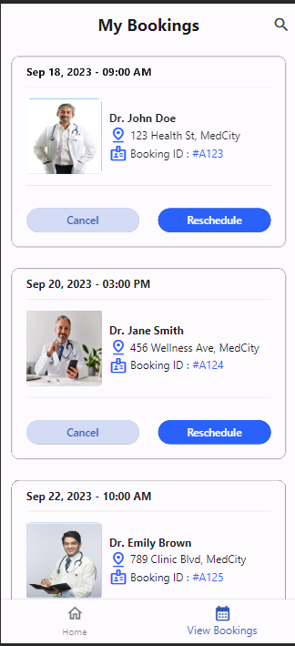

# ekam_cloud_clinic

A new Flutter project.

## Getting Started

To get started, clone this repository and run the following commands:

```
flutter pub get
flutter run
```

## Features

The Cloud Clinic App presents a list of doctors through which users can book appointments.

- FutureBuilder
- ListViewBuilder
- FilterChip
- Radio
- DropDown
- Bottom Navigation Bar
- Circle Avatar

## Usage

Users can select a doctor by tapping on to the card. which will lead them to Doctor detail screen.

## Development

The app is developed using Flutter. The code is well-organized and commented.

| Doctors List                                | Doctor Detail Screen                                          |
| ------------------------------------------- | ------------------------------------------------------------- |
|  |  |

| Select Package Screen                                           | Review Summary Screen                                           |
| --------------------------------------------------------------- | --------------------------------------------------------------- |
|  |  |

| Booking Confirmation Screen                                         | View All Bokkings                                          |
| ------------------------------------------------------------------- | ---------------------------------------------------------- |
|  |  |
