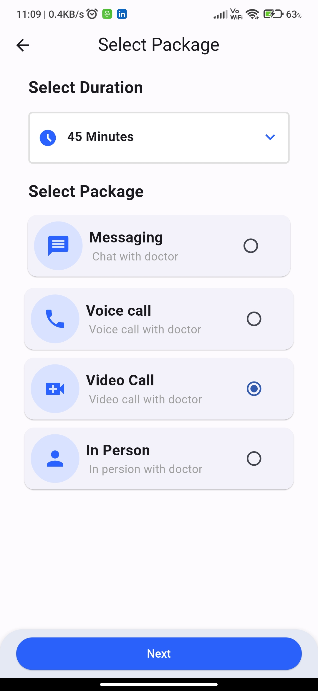

# cloud_clinic

A new Flutter project.

## Getting Started

To get started, clone this repository and run the following commands:

```
flutter pub get
flutter run
```

## Features

The Cloud Clinic App presents a list of doctors through which users can book appointments.

- FutureBuilder
- ListViewBuilder
- FilterChip
- Radio
- DropDown
- Bottom Navigation Bar
- Circle Avatar

### Key Features:

- **Appointment Scheduling**: Users can easily schedule appointments with doctors based on their availability on specific dates.
- **Flexible Consultation Options**: The app offers various consultation options, including messaging, video calls, voice calls, and in-person visits, allowing users to choose the communication method that suits their needs.
- **Customizable Consultation Duration**: Users can personalize their consultation by selecting the desired duration with the doctor.
- **User-Friendly Interface**: The app provides an intuitive and user-friendly interface for a seamless experience.

## Usage

Users can select a doctor by tapping on the card. which will lead them to Doctor's detail screen.

## Development

The app is developed using Flutter. The code is well-organized and commented.

| Doctors List                                | Doctor Detail Screen                                          |
| ------------------------------------------- | ------------------------------------------------------------- |
|  |  |

| Select Package Screen                                           | Review Summary Screen                                           |
| --------------------------------------------------------------- | --------------------------------------------------------------- |
|  |  |

| Booking Confirmation Screen                                         | View All Bokkings                                          |
| ------------------------------------------------------------------- | ---------------------------------------------------------- |
|  |  |

### Note:

This project is not connected to a live backend or database for functional use.
